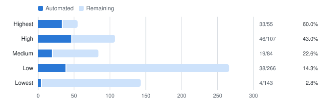

<!-- Generated by `pixi run coverage`; do not edit by hand. -->

# Command coverage

How much of the manual conda CLI test inventory has an automated E2E test.

This is **not** code coverage — it measures nothing about which lines of conda
run. The denominator is [`tests/inventory/commands.csv`](tests/inventory/commands.csv),
a hand-written inventory of 655 CLI cases. A case counts as automated when a
test claims its `id` with `@pytest.mark.covers(...)`.

**140 of 655 cases automated — 21.4%**

`████░░░░░░░░░░░░░░░░`

## By priority

Where the gap actually matters. `Highest` and `High` are the rows to read first.

<picture>
  <source media="(prefers-color-scheme: dark)" srcset="docs/coverage-dark.svg">
  
</picture>

| Priority | Cases | Automated | Remaining | Coverage |
| --- | --: | --: | --: | --: |
| Highest | 55 | 33 | 22 | 60.0% |
| High | 107 | 46 | 61 | 43.0% |
| Medium | 84 | 19 | 65 | 22.6% |
| Low | 266 | 38 | 228 | 14.3% |
| Lowest | 143 | 4 | 139 | 2.8% |

## By subcommand

Sorted by number of cases still to automate — the top of this table is the
work queue.

| Subcommand | Cases | Automated | Remaining | Coverage | |
| --- | --: | --: | --: | --: | :-- |
| conda config | 90 | 11 | 79 | 12.2% | `██░░░░░░░░░░░░░░░░░░` |
| conda env | 50 | 7 | 43 | 14.0% | `███░░░░░░░░░░░░░░░░░` |
| conda index | 39 | 0 | 39 | 0.0% | `░░░░░░░░░░░░░░░░░░░░` |
| conda create | 54 | 22 | 32 | 40.7% | `████████░░░░░░░░░░░░` |
| conda search | 29 | 0 | 29 | 0.0% | `░░░░░░░░░░░░░░░░░░░░` |
| conda export | 28 | 0 | 28 | 0.0% | `░░░░░░░░░░░░░░░░░░░░` |
| conda list | 30 | 4 | 26 | 13.3% | `███░░░░░░░░░░░░░░░░░` |
| conda tos | 25 | 0 | 25 | 0.0% | `░░░░░░░░░░░░░░░░░░░░` |
| conda remove | 24 | 0 | 24 | 0.0% | `░░░░░░░░░░░░░░░░░░░░` |
| conda doctor | 19 | 0 | 19 | 0.0% | `░░░░░░░░░░░░░░░░░░░░` |
| conda install | 66 | 47 | 19 | 71.2% | `██████████████░░░░░░` |
| conda init | 18 | 0 | 18 | 0.0% | `░░░░░░░░░░░░░░░░░░░░` |
| conda pypi | 18 | 0 | 18 | 0.0% | `░░░░░░░░░░░░░░░░░░░░` |
| conda check | 15 | 0 | 15 | 0.0% | `░░░░░░░░░░░░░░░░░░░░` |
| conda notices | 11 | 0 | 11 | 0.0% | `░░░░░░░░░░░░░░░░░░░░` |
| conda repoquery | 11 | 0 | 11 | 0.0% | `░░░░░░░░░░░░░░░░░░░░` |
| conda token | 11 | 0 | 11 | 0.0% | `░░░░░░░░░░░░░░░░░░░░` |
| conda rename | 10 | 0 | 10 | 0.0% | `░░░░░░░░░░░░░░░░░░░░` |
| conda content-trust | 9 | 0 | 9 | 0.0% | `░░░░░░░░░░░░░░░░░░░░` |
| conda compare | 8 | 0 | 8 | 0.0% | `░░░░░░░░░░░░░░░░░░░░` |
| conda run | 8 | 0 | 8 | 0.0% | `░░░░░░░░░░░░░░░░░░░░` |
| conda update | 8 | 0 | 8 | 0.0% | `░░░░░░░░░░░░░░░░░░░░` |
| conda self | 6 | 0 | 6 | 0.0% | `░░░░░░░░░░░░░░░░░░░░` |
| conda menuinst | 5 | 0 | 5 | 0.0% | `░░░░░░░░░░░░░░░░░░░░` |
| conda | 3 | 0 | 3 | 0.0% | `░░░░░░░░░░░░░░░░░░░░` |
| conda clean | 18 | 15 | 3 | 83.3% | `█████████████████░░░` |
| conda info | 20 | 17 | 3 | 85.0% | `█████████████████░░░` |
| conda activate | 7 | 6 | 1 | 85.7% | `█████████████████░░░` |
| conda commands | 1 | 0 | 1 | 0.0% | `░░░░░░░░░░░░░░░░░░░░` |
| conda deactivate | 2 | 1 | 1 | 50.0% | `██████████░░░░░░░░░░` |
| conda package | 11 | 10 | 1 | 90.9% | `██████████████████░░` |
| conda repo | 1 | 0 | 1 | 0.0% | `░░░░░░░░░░░░░░░░░░░░` |

## Tests with no inventory link

10 test(s) carry no `covers` marker, so they do not count
toward the numbers above. Either link them to an inventory case or add the
case they exercise.

- `tests/e2e/env/test_env_list.py::test_env_list_matches_info_envs`
- `tests/e2e/env/test_env_list.py::test_env_list_matches_info_envs_when_activated`
- `tests/e2e/env/test_env_list.py::test_env_list_rejects_unsupported_option`
- `tests/e2e/info/test_info_envs.py::test_conda_info_envs_includes_base_with_install_path`
- `tests/e2e/info/test_info_envs.py::test_conda_info_envs_marks_active_and_frozen_on_same_env`
- `tests/e2e/info/test_info_envs.py::test_conda_info_envs_marks_active_and_frozen_on_same_env_json`
- `tests/e2e/info/test_info_envs.py::test_conda_info_envs_marks_base_active_when_base_activated`
- `tests/e2e/info/test_info_envs.py::test_conda_info_envs_marks_base_active_when_base_activated_json`
- `tests/e2e/info/test_info_envs.py::test_conda_info_envs_marks_frozen_env_separately_from_active`
- `tests/e2e/info/test_info_envs.py::test_conda_info_envs_marks_frozen_env_separately_from_active_json`
